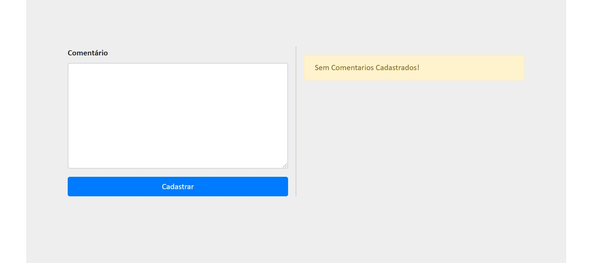
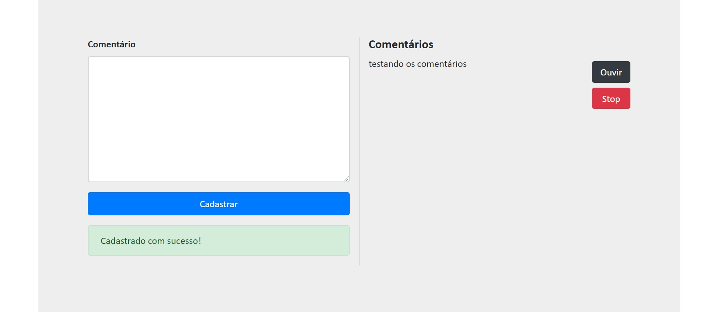

<!-- PROJECT LOGO -->
<br />
<p align="center">
  <a href="https://github.com/othneildrew/Best-README-Template">
    
  </a>

  <h3 align="center">Smarkio Challenge</h3>

  <p align="center">
    Esse é um projeto trabalhado na construção de comentários onde utiliza a API Text to Speech
    <br />
  </p>
</p>

## Introdução 
Foi elaborado um projeto onde possui um sistema de comentários que presta o serviço de leitura do comentário por audio.

### Interface:


### Realizando o comentário:


## Instalação

### Banco:
A `porta do mysql está como: 3306`, se sua porta for diferente, tem que muda-la.
```
CREATE DATABASE smarkio;

CREATE TABLE `comentarios` (
  `comentario_id` int(11) NOT NULL primary key auto_increment,
  `texto` varchar(10000) DEFAULT NULL
);

```
### Código:
No terminal, só digitar a sequencia abaixo, lembrando que a `porta do localhost é: 3000`
```
npm install
```
Continuando no terminal, para rodar a aplicação seria:
```
node app.js ou nodemon app.js
```
## Tecnologias Utilizadas 

* API Text to Speech - IBM Watson
* Boostrap 4
* Jquery
* Ajax
* NodeJs
* Banco MySql
